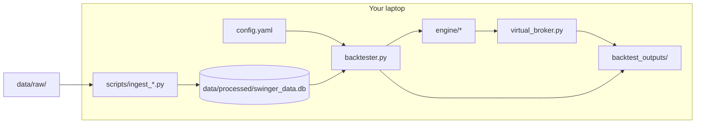

# Backtest Implementation Plan — Laptop Execution

**Companion to:** [`REQUIREMENTS_v1.md`](REQUIREMENTS_v1.md) v1.2 (build spec) · [`BACKTEST_PLAN_Darvas_Trading_v1.md`](BACKTEST_PLAN_Darvas_Trading_v1.md) (data runbook)  
**Version:** 1.0 | **Date:** 2026-06-19  
**Target:** Full NIFTY 500 backtest **2018-01-01 → 2026-05-31**, ₹5L initial capital, runnable on a **local Windows laptop** (native Python or WSL2).

---

## 1. Goal and success criteria

### 1.1 What you are building

A **local, CLI-driven backtest** that replays the Darvas Box strategy once per NSE trading day — same logic as live 16:30 IST EOD — without broker connectivity. The backtest shares `run_daily_strategy_iteration()` with the future live path; only the broker leg is simulated.

### 1.2 Done when

| Milestone | Verification |
|---|---|
| **M0** Environment boots | `pytest tests/` green; `python scripts/run_backtest.py --help` works |
| **M1** Data lake local | `data/processed/swinger_data.db` has bars 2016-09 → 2026, PIT fundamentals from 2017, NIFTY 500 membership |
| **M2** Engine unit tests | Section 15 tests in REQUIREMENTS pass (Darvas, sizing, ranking, TRAIL 10% gate, PIT lookahead) |
| **M3** Smoke backtest | Q1 2018 slice completes in < 2 min; non-empty `decision_log.csv` |
| **M4** Full backtest | 2018–2026 completes in **< 30 min**, RAM **< 2 GB** |
| **M5** Outputs auditable | Four CSV/JSON files + `data_quality_report.md` produced |

### 1.3 Out of scope for this plan

- Live Lambda, DynamoDB, Upstox/Kite order placement (M6–M8 in REQUIREMENTS §3)
- Web dashboard, LLM advisor (v2)
- Intraday bars, tick data, `ALL_NSE` universe

---

## 2. Architecture (backtest path only)



**Key design rule:** `engine.py` is **pure** — no SQLite, no broker imports. The backtester injects `MarketContext`, price matrices, and PIT fundamentals; the virtual broker applies fills after the engine returns `PlannedGTTAction` rows.

---

## 3. Laptop prerequisites

### 3.1 Hardware and OS

| Resource | Minimum | Recommended |
|---|---|---|
| RAM | 8 GB | 16 GB |
| Disk | 15 GB free | 25 GB (raw Bhavcopy ZIPs + SQLite) |
| CPU | 4 cores | 8 cores |
| OS | Windows 10/11 | WSL2 Ubuntu 22.04 **or** native Python 3.11+ |

NSE bulk download scripts behave more reliably under **WSL2** (fewer path/SSL quirks). Native Windows works if ingest scripts are tested early.

### 3.2 Software stack

```powershell
# From repo root (PowerShell — adjust path if using WSL)
cd c:\code\Swinger
python -m venv .venv
.\.venv\Scripts\Activate.ps1
python -m pip install -U pip
```

**`requirements.txt` (pin during M1 implementation):**

| Package | Purpose |
|---|---|
| `pydantic`, `pyyaml` | Config + models (M1) |
| `pandas`, `numpy` | Bars, engine math (M3–M5) |
| `pyarrow` | Parquet optional export |
| `pytest` | Section 15 acceptance tests |
| `jugaad-data` or custom Bhavcopy fetcher | NSE EOD ingest |
| `nse-xbrl` | Integrated filing parser (2025+); extend for legacy |
| `requests`, `tenacity` | NSE API with retries |

No broker SDK required for backtest-only path.

### 3.3 Directory layout (create before coding)

```
Swinger/
├── config.yaml
├── requirements.txt
├── data/
│   ├── raw/
│   │   ├── bhavcopy/           # daily ZIP archives
│   │   ├── nifty_indices/      # monthly constituent files
│   │   └── nse_filings/        # XBRL + SHP downloads
│   ├── processed/
│   │   └── swinger_data.db     # single SQLite data lake
│   └── reference/
│       ├── nse_holidays.csv
│       ├── sector_map.csv
│       └── asm_gsm/              # cached daily lists
├── backtest_outputs/             # gitignore; run artifacts
└── src/                          # per REQUIREMENTS §2
```

Add to `.gitignore`: `.venv/`, `data/raw/`, `data/processed/*.db`, `backtest_outputs/`.

---

## 4. Configuration (`config.yaml`)

Copy the block from **REQUIREMENTS §13**. Backtest-relevant subset:

```yaml
backtest:
  target_segment: NIFTY_500
  start_date: "2018-01-01"
  end_date: "2026-05-31"
  initial_capital_inr: 500000.0
  price_warmup_start_date: "2016-09-01"
  export_directory: "./backtest_outputs"
  simulation_slippage_pct: 0.05
  execution_environment: local
  data_db_path: "./data/processed/swinger_data.db"   # add in config.py

risk_management:
  kill_switch_daily_loss_limit_inr: 25000   # = initial_capital × 0.05
  min_structural_r_ratio: 3.0
  gtt_trigger_buffer_inr: 0.05

trailing_stop:
  max_trail_risk_pct: 10.0
```

`system.broker.*` is ignored by the backtest CLI — no live credentials needed.

---

## 5. Build phases (dependency order)

Follow REQUIREMENTS §3 modules **M1 → M5** only. Estimated calendar time assumes part-time work.

| Phase | Modules | Duration | Deliverable |
|---|---|---|---|
| **P0** Setup | — | 0.5 day | venv, dirs, empty `config.yaml`, pytest scaffold |
| **P1** Foundation | M1, M2 | 2–3 days | `config.py`, `models.py`, `repository/sqlite.py`, schema migrations |
| **P2** Data lake | M3 | 1–2 weeks | Ingest scripts + populated `swinger_data.db` |
| **P3** Strategy engine | M4 | 1 week | `engine/*` + unit tests |
| **P4** Backtest runner | M5 | 3–5 days | `backtester.py`, `virtual_broker.py`, `run_backtest.py` |
| **P5** Full run + QA | — | 2–3 days | Full 2018–2026 run, quality report, idempotency check |

---

## 6. Phase P1 — Foundation (M1 + M2)

### 6.1 Files to implement

| File | Responsibility |
|---|---|
| `src/config.py` | Load YAML; validate auth binding (warn-only in backtest mode); reject deprecated keys (§0) |
| `src/models.py` | `MarketContext`, `OpenPosition`, `PlannedGTTAction`, `DecisionLogRow`, `BoxState`, `TradeLedgerRow` |
| `src/repository/base.py` | Abstract `Repository` (REQUIREMENTS §5) |
| `src/repository/sqlite.py` | Two SQLite modes: **data lake** (read-only bars/PIT) and **run state** (per-backtest mutable) |

### 6.2 Data lake schema (`swinger_data.db`)

```sql
-- Price
CREATE TABLE daily_bars (
    symbol TEXT NOT NULL,
    date   DATE NOT NULL,
    open REAL, high REAL, low REAL, close REAL,
    volume INTEGER,
    turnover_inr REAL,
    PRIMARY KEY (symbol, date)
);
CREATE INDEX idx_daily_bars_date ON daily_bars(date);

-- PIT fundamentals (REQUIREMENTS §5)
CREATE TABLE fundamentals_pit (
    symbol TEXT NOT NULL,
    metric TEXT NOT NULL,
    period_end DATE,
    effective_date DATE NOT NULL,
    value REAL NOT NULL,
    source TEXT NOT NULL,
    source_url TEXT,
    PRIMARY KEY (symbol, metric, effective_date)
);

-- Universe
CREATE TABLE nifty500_membership (
    symbol TEXT NOT NULL,
    effective_date DATE NOT NULL,
    PRIMARY KEY (symbol, effective_date)
);

-- Reference
CREATE TABLE trading_calendar (date DATE PRIMARY KEY, is_trading_day INTEGER);
CREATE TABLE sector_map (symbol TEXT PRIMARY KEY, sector TEXT);
CREATE TABLE asm_gsm_exclusions (symbol TEXT, date DATE, list_type TEXT,
    PRIMARY KEY (symbol, date, list_type));
CREATE TABLE earnings_calendar (symbol TEXT, event_date DATE, event_type TEXT,
    PRIMARY KEY (symbol, event_date));
```

### 6.3 Backtest run schema (separate file or `:memory:`)

Per run: `active_state_registry`, `trade_ledger`, `system_state`, `decision_log` — as REQUIREMENTS §5. Write to `backtest_outputs/run_<timestamp>.db` or embed in export CSVs only (simpler for v1: **CSV export only**, SQLite run state in temp file deleted after run).

### 6.4 P1 exit check

```powershell
pytest tests/test_config.py -v
python -c "from src.config import load_config; c=load_config('config.yaml'); print(c.backtest.start_date)"
```

---

## 7. Phase P2 — Data lake (M3)

Detailed ingest steps live in **BACKTEST_PLAN §5**. Summary for laptop execution:

### 7.1 Price ingest (Phase 0 in BACKTEST_PLAN)

**Script:** `scripts/ingest_bhavcopy.py`

```
Input:  data/raw/bhavcopy/cm*.csv / .zip  (2016-09-01 → 2026-05-31)
Output: daily_bars table
Filter: SERIES = 'EQ' only; map NSE symbol renames via reference table
```

**Implementation notes:**

- Download in monthly/yearly batches; NSE rate-limits — sleep 1–2 s between requests.
- Handle Bhavcopy schema change mid-2024 (column name mapping).
- Restrict to **symbols that ever appear in NIFTY 500** (saves ~95% rows).
- Store NIFTY 50 index series as symbol `NIFTY 50` for trend filter.

**Optional validation:** `scripts/ingest_upstox_validate.py` — sample 50 symbols vs Upstox V3 daily candles; log mismatches > ₹0.05 to `data_quality_report.md`.

### 7.2 Universe ingest

**Script:** `scripts/ingest_nifty500_constituents.py`

- Source: [Nifty Indices historical archives](https://www.niftyindices.com/reports/historical-data)
- Parse monthly weightage reports → `(symbol, effective_date)` rows
- Forward-fill membership between rebalance dates

### 7.3 PIT fundamentals (Phase 1 in BACKTEST_PLAN)

| Script | Source | Metrics |
|---|---|---|
| `scripts/ingest_nse_xbrl.py` | NSE financial results XBRL | revenue_growth_pct, eps_growth_pct, roe_pct, roce_pct, debt_to_equity |
| `scripts/ingest_nse_shp.py` | Shareholding pattern | promoter_holding_pct |
| `scripts/ingest_nse_announcements.py` | Corp announcements | earnings dates |

**PIT rule (non-negotiable):**

```
effective_date = next_trading_session_after(submission_date)
JOIN on date T: MAX(effective_date) WHERE effective_date <= T
```

**Orchestrator:** `scripts/ingest_all.py --from 2016-09-01 --pit-from 2017-01-01`

### 7.4 Reference data

**Script:** `scripts/ingest_reference.py`

- NSE holiday PDF → `trading_calendar`
- NSE sector classification CSV → `sector_map`
- ASM/GSM daily lists (best-effort historical; flag gaps pre-2015)

### 7.5 P2 exit checks

```powershell
python scripts/ingest_all.py --verify-only
pytest tests/test_pit.py -v
```

| Check | SQL / assertion |
|---|---|
| Bar coverage | ≥ 280 sessions before 2018-01-01 for sample of 20 NIFTY 500 names |
| PIT no lookahead | Shift all `effective_date` +90d in test fixture → filter pass rate drops |
| Membership | `nifty500_membership` has rows before 2018-01-01 |

Emit **`data/processed/pit_coverage_report.csv`** and **`data/processed/data_quality_report.md`**.

---

## 8. Phase P3 — Strategy engine (M4)

Implement in dependency order:

```
filters.py  →  darvas.py  →  risk.py  →  ranking.py  →  engine.py
```

### 8.1 `engine/filters.py`

- Universe: NIFTY 500 on date T, volume, turnover, price, ASM/GSM
- Fundamentals: PIT join per REQUIREMENTS §12
- Earnings blackout: `avoid_days_before_earnings` (entry filter only)
- `enforce_long_term_growth_group`: 3-year positive YoY EPS (PIT)
- NIFTY 50 trend filter input (passed from index bars)

### 8.2 `engine/darvas.py`

Full state machine — REQUIREMENTS §6:

- Hybrid Darvas + ATR box bounds
- Transitions including volume-confirmed BREAKOUT
- Trend filter freezes advancement (no SCANNING reset on index fail)
- Continue box updates for symbols with open positions

### 8.3 `engine/risk.py`

- Position sizing (three-cap min + all-or-nothing cash)
- Entry/trigger/stop/target prices (including `gtt_trigger_buffer_inr`)
- `min_structural_r_ratio` rejection
- **TRAIL_OCO** with **10% risk gate** (REQUIREMENTS §7)

### 8.4 `engine/ranking.py`

- Greedy selection by `structural_rr` → sector RS → breakout volume ratio
- Skip reasons enum

### 8.5 `engine/engine.py`

```python
def run_daily_strategy_iteration(
    context: MarketContext,
    price_data: PriceDataMatrix,
    fundamentals: list[PointInTimeFundamentals],
    state_registry: dict[str, BoxState],
    config: AppConfig,
) -> tuple[list[PlannedGTTAction], dict[str, BoxState], list[DecisionLogRow]]:
```

**Order inside engine (single date T):**

1. Update Darvas registry for all universe symbols
2. TRAIL_OCO for open positions (10% gate)
3. If not `kill_switch_active`: evaluate BREAKOUT candidates → filters → structural R min → size → rank → PLACE_BUY_GTT
4. Emit decision log row per symbol touched

Kill-switch **trip** is **not** in engine — backtester evaluates after mark-to-market (REQUIREMENTS §7).

### 8.6 P3 exit check

```powershell
pytest tests/test_darvas.py tests/test_risk.py tests/test_ranking.py -v
```

All Section 15 engine tests green before proceeding.

---

## 9. Phase P4 — Backtest runner (M5)

### 9.1 `src/backtest/virtual_broker.py`

Simulates GTT lifecycle. State: pending buy orders, open positions with OCO legs.

| Event | Rule (REQUIREMENTS §8 + BACKTEST_PLAN §6.2) |
|---|---|
| Buy fill | `high[T] >= trigger_price` → fill at `trigger × (1 + slippage)` |
| ESTABLISH_OCO | On fill same day: set stop/target from action |
| Stop hit | `low[T] <= stop` → exit at `stop × (1 - slippage)` |
| Target hit | `high[T] >= target` → exit at `target × (1 - slippage)` |
| Same-bar stop & target | **Stop first** (conservative) |
| TRAIL_OCO | Update stop upward only; from engine action |
| CANCEL_BUY_GTT | Remove pending order (box invalidation / rank out) |
| Settlement | Sale proceeds → settled cash on **T+2**; buys require settled cash |

**Breakout vs fill distinction:**

- Engine declares BREAKOUT on **`close > box_top` + volume** (signal)
- Virtual fill uses **`high >= trigger_price`** where `trigger = box_top + buffer`

### 9.2 `src/backtest/backtester.py`

**Daily loop** for each trading session `T` from `start_date` to `end_date`:

```text
1. Skip if T not in trading_calendar
2. Build universe = NIFTY500 members on T
3. Load OHLCV slice through T (280+ day window per symbol)
4. Build MarketContext:
     - account_equity, settled_cash_inr (T+2 settlement)
     - open_positions from virtual_broker
     - kill_switch_active from system_state
5. virtual_broker.apply_corporate_actions(T)   # splits/bonus on open qty
6. virtual_broker.process_intraday_fills(T, bars)  # stops/targets/fills using H/L
7. Mark-to-market at close[T] → update equity
8. Kill switch: compare equity[T] vs equity[T-1]; latch if daily_loss >= limit
9. actions, registry, decisions = run_daily_strategy_iteration(...)
10. virtual_broker.apply_actions(T, actions)   # place/cancel GTTs, trails
11. Persist registry, decision_log, equity_curve row
12. Advance pending orders (working buys carry forward)
```

**Performance tactics (REQUIREMENTS §8: < 30 min, < 2 GB):**

- Pre-load index + sector maps once
- Chunk universe by symbol batch (e.g. 50) for Darvas updates
- Use SQLite indexed reads: `WHERE symbol IN (...) AND date <= ?`
- Avoid building full 500 × 3000 day DataFrame in memory

### 9.3 `scripts/run_backtest.py`

```powershell
python scripts/run_backtest.py --config config.yaml
python scripts/run_backtest.py --config config.yaml --start 2018-01-01 --end 2018-03-31  # smoke
python scripts/run_backtest.py --config config.yaml --resume  # optional: continue from last date
```

Flags to implement: `--config`, `--start`, `--end`, `--output-dir`, `--smoke` (Q1 2018 preset).

### 9.4 Output files

| File | Contents |
|---|---|
| `decision_log.csv` | All columns in BACKTEST_PLAN §6.3 + `skip_reason`, `structural_rr` |
| `trade_ledger.csv` | Entries/exits: dates, prices, qty, stop, target, `exit_reason`, `realized_pnl_inr`, `r_multiple`, `structural_rr_at_entry` |
| `equity_curve.csv` | `date`, `equity`, `settled_cash`, `unsettled_cash`, `drawdown_pct`, `kill_switch_active`, `open_positions_count` |
| `summary_report.json` | CAGR, max DD, win rate, avg R, trades/year, sector breakdown, config hash, git commit (if available) |

### 9.5 P4 exit check — smoke run

```powershell
python scripts/run_backtest.py --config config.yaml --start 2018-01-01 --end 2018-03-31
pytest tests/test_parity.py -v   # mocked inputs → deterministic actions
```

Re-run same smoke date twice → **identical** `decision_log.csv` (idempotency).

---

## 10. Phase P5 — Full run and validation

### 10.1 Full backtest command

```powershell
python scripts/run_backtest.py --config config.yaml
```

Expected runtime: **15–30 minutes** on a modern laptop once data is local.

### 10.2 Post-run checklist

- [ ] `summary_report.json` parses; CAGR and max drawdown present
- [ ] `trade_ledger.csv` has both BUY and SELL rows with `exit_reason`
- [ ] Kill switch latched at least once in stress window (or document if never tripped)
- [ ] `decision_log.csv` includes `STRUCTURAL_R_BELOW_MIN` and `RANKED_OUT` skip rows
- [ ] PIT lookahead test still passes after full run fixtures
- [ ] Idempotency: second full run with same config → identical trade count

### 10.3 Sanity probes (manual)

| Probe | How |
|---|---|
| Structural R filter | Grep decision_log for `structural_rr` values; none selected below 3.0 |
| TRAIL 10% gate | Find TRAIL_OCO rows; verify prior `Risk_pct <= 10` in payload/log |
| T+2 cash | After exit, verify settled_cash step-up lagged 2 sessions |
| Survivorship | Confirm delisted names appear in early-year universe if in historical N500 |

---

## 11. Test matrix (REQUIREMENTS §15)

Implement before full run:

| Test file | Covers |
|---|---|
| `tests/test_darvas.py` | State transitions, hybrid box, volume breakout, trend freeze |
| `tests/test_risk.py` | Sizing caps, structural R min, TRAIL 10% gate, kill switch math |
| `tests/test_ranking.py` | Greedy fill, sector cap, concurrency, tiebreakers |
| `tests/test_pit.py` | effective_date join, +90d shift lookahead |
| `tests/test_parity.py` | Same inputs → identical `PlannedGTTAction` list + idempotency keys |

```powershell
pytest tests/ -v --tb=short
```

---

## 12. Troubleshooting (laptop)

| Symptom | Likely cause | Fix |
|---|---|---|
| NSE download 403 | Missing User-Agent / rate limit | WSL2 + browser-like headers; retry with backoff |
| Empty fundamentals for 2018 symbols | PIT ingest not prefetched from 2017 | Re-run `ingest_nse_xbrl.py --from 2017-01-01` |
| Zero trades entire run | Trend filter always failing | Verify NIFTY 50 index bars loaded |
| OOM during full run | Full universe DataFrame | Batch symbols; reduce in-memory window |
| Runs differ on re-run | Non-deterministic tie-break or float order | Fix sort keys; round structural_rr to 4 dp |
| Very slow (> 1 hr) | Missing SQLite index | Add indexes; profile with `--start` slice |

---

## 13. Implementation checklist (copy to issue tracker)

### P0 — Setup
- [ ] Create venv and `requirements.txt`
- [ ] Create `data/` tree and `.gitignore`
- [ ] Add `config.yaml` from REQUIREMENTS §13

### P1 — Foundation
- [ ] `src/config.py` + validation rules
- [ ] `src/models.py`
- [ ] `src/repository/base.py`, `sqlite.py`
- [ ] Data lake schema migration script

### P2 — Data
- [ ] `scripts/ingest_bhavcopy.py`
- [ ] `scripts/ingest_nifty500_constituents.py`
- [ ] `scripts/ingest_nse_xbrl.py`, `ingest_nse_shp.py`, `ingest_nse_announcements.py`
- [ ] `scripts/ingest_reference.py`
- [ ] `scripts/ingest_all.py`
- [ ] `pit_coverage_report.csv`, `data_quality_report.md`

### P3 — Engine
- [ ] `src/engine/filters.py`
- [ ] `src/engine/darvas.py`
- [ ] `src/engine/risk.py`
- [ ] `src/engine/ranking.py`
- [ ] `src/engine/engine.py`
- [ ] Unit tests green

### P4 — Backtest
- [ ] `src/backtest/virtual_broker.py`
- [ ] `src/backtest/backtester.py`
- [ ] `scripts/run_backtest.py`
- [ ] CSV/JSON exporters
- [ ] Smoke run Q1 2018

### P5 — Full run
- [ ] Full 2018–2026 backtest
- [ ] Idempotency verified
- [ ] `summary_report.json` reviewed
- [ ] Ready for advisor module (M9) input

---

## 14. Document map

| Question | Read |
|---|---|
| What to build (modules, formulas, config)? | `REQUIREMENTS_v1.md` |
| How to download NSE data? | `BACKTEST_PLAN_Darvas_Trading_v1.md` §5 |
| Why a decision was made vs PRD v5/v6? | `REQUIREMENTS_v1.md` §0 |
| Step-by-step laptop build (this doc)? | `IMPLEMENTATION_PLAN_Backtest.md` |
| Agent coding order? | `AGENTS.md` |

---

## 15. Suggested first coding session (day 1)

1. Scaffold P0 (venv, dirs, `config.yaml`, pytest).
2. Implement M1 (`config.py`, `models.py`) with tests.
3. Create empty `swinger_data.db` with schema from §6.2.
4. Implement minimal `ingest_bhavcopy.py` for **one month** of data → verify bars query.
5. Stub `run_backtest.py` that prints trading days from `trading_calendar` — proves end-to-end wiring before engine complexity.

This gives a runnable skeleton on your laptop within a day; data lake bulk download can run overnight while you build M4 engine tests against fixtures.
