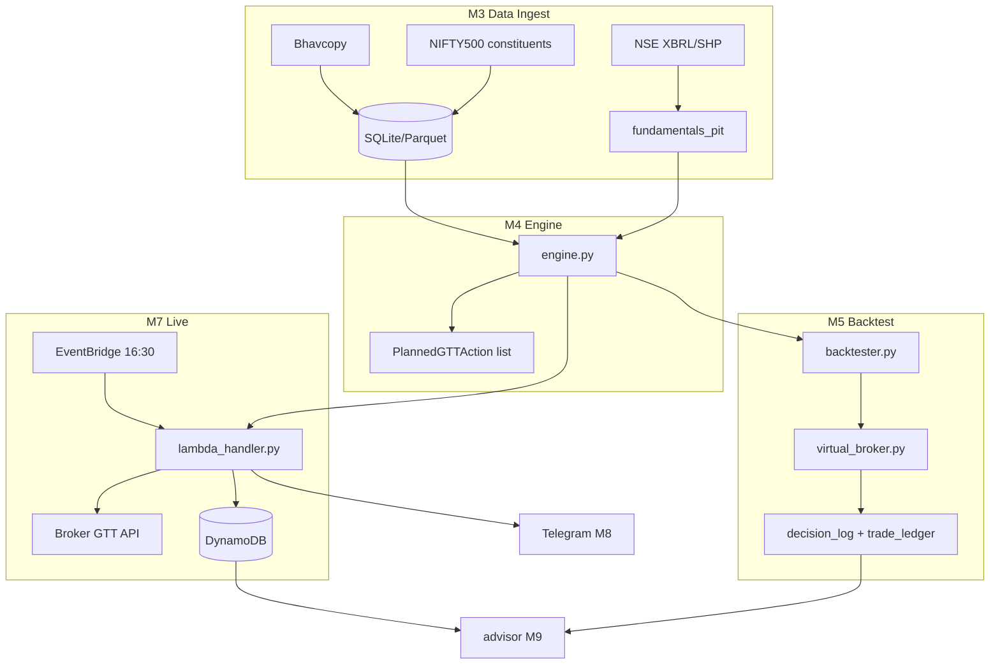
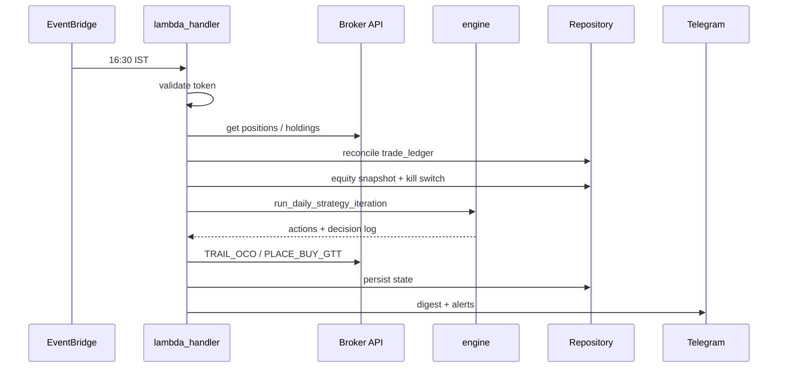

# Swinger v1 — Build Requirements

**Product:** Darvas Box swing-trading system for NSE CASH segment — daily EOD strategy, GTT orders via broker API (Upstox or Zerodha Kite), NIFTY 500 universe.  
**Version:** 1.2 | **Date:** 2026-06-19  
**Scope:** MVP v1 only. Items marked **(v2)** are out of scope.

**Document authority:** This file is the **single source of truth** for implementation. `PRD_Darvas_Trading_v4.md` is retained as decision history and commentary. `PRD_Darvas_Trading_v5.md` and `PRD_Darvas_Trading_v6.md` are condensed product sketches — where they diverge from this file, **Section 0** records the binding resolution. `BACKTEST_PLAN_Darvas_Trading_v1.md` is the data-ingest runbook companion for Section 8 and Section 12. **`IMPLEMENTATION_PLAN_Backtest.md`** is the step-by-step laptop build guide for modules M1–M5.

---

## 0. PRD v5/v6 reconciliation (binding decisions)

Condensed PRDs v5 and v6 reintroduce several v3.0 fields that conflict with v4.3 and this spec. The table below is authoritative for build agents.

| Topic | PRD v5/v6 | Binding decision (this file) | Rationale |
|---|---|---|---|
| **Live broker** | Upstox (v6); Upstox/Kite (v5) | **`upstox` is the default**; `zerodha_kite` optional — pluggable GTT client behind `src/broker/` | Confirmed product-owner default (v6) |
| **Live persistence** | SQLite file on S3/EFS, pull/push each Lambda run | **DynamoDB** for live; **SQLite** for backtest only | v4 §11 — S3 has no row locking; retry mid-write risks corruption |
| **Fundamentals (backtest + live screens)** | `fundamental_filters.source: broker_api` | **`nse_official_xbrl_pit`** warehouse with `effective_date` discipline | Broker APIs expose current snapshots; PIT join is mandatory for 2018–2026 backtest |
| **Fundamentals (live validation)** | Broker API implied as primary | Optional **cross-check** via broker quote API after PIT join; never replace PIT as primary | Parity with backtest decision log |
| **Universe lookback** | `lookback_years_for_doubling: 2` | **`lookback_years_for_52wk_high: 1`** + **`require_new_52wk_high: true`** for `SCANNING → FORMING` | Darvas precondition is new 52-week high (~252 sessions), not a 2-year doubling rule; v5/v6 field is deprecated |
| **Darvas box bounds** | Duration/height/volume knobs only | **Hybrid Darvas 3-day reversal + ATR bands** (Section 6) | Undefined in v5/v6; v4 §8 is binding |
| **Structural R minimum** | `min_structural_r_ratio: 3.0` (1:3 filter) | **Adopted** — reject candidates with `structural_rr < min_structural_r_ratio` before ranking (Section 7) | Explicit v5/v6 requirement; was implicit in v4 narrative only |
| **Kill switch limit** | `kill_switch_daily_loss_limit_inr: 50000` | **Default `25000` at ₹5L book**; scale as `initial_capital_inr × 0.05` unless overridden | v5/v6 assumed ~₹10L; backtest default is ₹5L (`BACKTEST_PLAN`) |
| **TRAIL_OCO eligibility** | Step 4.4: trail only if position `Risk_pct ≤ 10%` | **Adopted** — box-bottom ratchet (Section 7) runs only when `Risk_pct ≤ trailing_stop.max_trail_risk_pct` (default 10%) | Product-owner override; defers ratchet when proposed stop still implies >10% equity at risk |
| **GTT buy trigger price** | `B_top + 0.05 INR` (Case A) | **`trigger_price = box_top + gtt_trigger_buffer_inr`** (default `0.05`) | Adopts v5/v6 offset; sizing still uses `entry_price = box_top` for structural_rr |
| **GTT stop price** | `B_bottom − 0.05 INR` | **`stop_loss_price = box_bottom − stop_loss_buffer_fraction_inr`** (default `0.05`) | Same numeric default; config key matches v4 |
| **Backtest price data** | NSE Bhavcopy exclusively | **NSE Bhavcopy primary**; broker API optional validation/gap-fill | v5/v6 §4.3 aligned |
| **Backtest module** | Not specified (advisor only on-demand) | **`backtester.py` + `virtual_broker.py`** on local machine — never Lambda (Section 8) | v4 §3.2 |
| **Advisor** | LLM-generated optimization proposals | **v1:** deterministic JSON (sector/duration/sensitivity grid); **(v2):** optional LLM narrative layer | Avoid autonomous config mutation; v4 §13 |
| **`system_logs` table** | Present in v5/v6 schema | **Live:** required append-only audit log; **Backtest:** optional (decision_log is primary) | v5/v6 schema adopted for live |
| **Lambda NFRs** | ≤180 s runtime, ≤512 MB RAM | **Live Lambda:** must complete Steps 9.1–9.9 within **180 s** and **512 MB** | v5/v6 §7 adopted for live path only; backtest target remains Section 8 |
| **Auth / modes** | Not specified | **`discretionary` ↔ `manual_daily_login`**, **`fully_automated` ↔ `totp_automated_login`** (Section 14) | v4 §5 — both modes auto-place GTTs once token valid |
| **Market trend filter** | Top-level `market_trend_filter` in v5/v6 | Nested under **`darvas_box.market_trend_filter`** in config (Section 13) | Structural preference only; semantics unchanged |

---

## 1. Product scope

| In scope (v1) | Out of scope (v2+) |
|---|---|
| Daily run at 16:30 IST (live + backtest) | Intraday polling / kill-switch mid-session |
| Darvas box + fundamental pre-filter | `ALL_NSE` universe |
| Backtest 2018-01-01 → 2026-05-31, ₹5L | Web dashboard |
| Live Lambda + DynamoDB (not SQLite-on-S3) | Per-trade approve/reject UI |
| Broker: Upstox (default) or Zerodha Kite | |
| Structural R ≥ 1:3 entry filter | |
| TRAIL_OCO 10% risk gate on open positions | |
| Paper-trading logging mode | `expected_r` ranking from ML buckets |
| Telegram notifications | Aurora Postgres (use DynamoDB) |

**Strategy name:** Darvas Box entries with Minervini-style fundamental quality pre-filter (fundamentals do not affect box math).

---

## 2. Repository layout

```
Swinger/
├── config.yaml
├── requirements.txt
├── src/
│   ├── models.py              # Pydantic models — Section 4
│   ├── config.py              # Load + validate config.yaml
│   ├── repository/
│   │   ├── base.py            # Abstract repository — Section 5
│   │   ├── sqlite.py          # Backtest backend
│   │   └── dynamodb.py        # Live backend
│   ├── engine/
│   │   ├── filters.py         # Universe + fundamental screens
│   │   ├── darvas.py          # Box state machine — Section 6
│   │   ├── risk.py            # Sizing, kill switch, trail — Section 7
│   │   ├── ranking.py         # structural_rr greedy selection — Section 7
│   │   └── engine.py          # run_daily_strategy_iteration — orchestrator
│   ├── data/
│   │   ├── bhavcopy.py        # NSE EOD ingest
│   │   ├── nse_xbrl.py        # Financial results XBRL
│   │   ├── nse_shp.py         # Shareholding pattern
│   │   ├── nse_announcements.py
│   │   ├── pit.py             # fundamentals_pit warehouse + join
│   │   ├── constituents.py    # NIFTY 500 PIT membership
│   │   └── calendar.py        # NSE holidays, ASM/GSM cache
│   ├── backtest/
│   │   ├── backtester.py      # Day loop CLI
│   │   └── virtual_broker.py  # GTT fill simulation — Section 8
│   ├── broker/
│   │   ├── auth.py            # manual_daily_login + totp_automated_login
│   │   ├── base.py            # Abstract GTT client — Section 9
│   │   ├── upstox.py          # Default live broker (PRD v6)
│   │   └── kite.py            # Alternative: Zerodha Kite Connect
│   ├── live/
│   │   └── lambda_handler.py  # Daily 16:30 orchestration — Section 9
│   ├── notify/
│   │   └── telegram.py        # Section 10
│   └── advisor/
│       └── advisor.py         # Read-only JSON report — Section 11
├── scripts/
│   ├── ingest_all.py
│   └── run_backtest.py
├── tests/
│   ├── test_darvas.py
│   ├── test_risk.py
│   ├── test_ranking.py
│   ├── test_pit.py
│   └── test_parity.py
└── backtest_outputs/          # decision_log.csv, trade_ledger.csv, etc.
```

---

## 3. Build order & module dependencies

```
[M1] config + models
        ↓
[M2] repository (sqlite first)
        ↓
[M3] data ingest → pit warehouse          [M4] engine (pure; mock data in tests)
        ↓                                        ↓
[M5] backtester + virtual_broker  ←──────────────┘
        ↓
[M6] broker/auth + GTT client (upstox default)
        ↓
[M7] live lambda_handler + dynamodb repo
        ↓
[M8] telegram notify
        ↓
[M9] advisor (optional last)
```

| Module | Deliverable | Depends on |
|---|---|---|
| **M1** `config.py`, `models.py`, `config.yaml` | Validated config; Pydantic types | — |
| **M2** `repository/base.py`, `sqlite.py` | CRUD for all tables | M1 |
| **M3** `data/*` | Local Parquet/SQLite: bars, pit, constituents | M1 |
| **M4** `engine/*` | `run_daily_strategy_iteration()` | M1, M2 (interface) |
| **M5** `backtester.py`, `virtual_broker.py` | CLI backtest + CSV outputs | M2, M3, M4 |
| **M6** `broker/*` | Upstox/Kite GTT + auth | M1 |
| **M7** `lambda_handler.py`, `dynamodb.py` | EventBridge daily live run | M2, M4, M6 |
| **M8** `telegram.py` | Alerts + digests | M1 |
| **M9** `advisor.py` | Advisory JSON | M2 |

---

## 4. Core types (`src/models.py`)

```python
class MarketContext(BaseModel):
    target_date: date
    account_equity: float
    settled_cash_inr: float
    open_positions: list[OpenPosition]
    kill_switch_active: bool

class OpenPosition(BaseModel):
    symbol: str
    quantity: int
    entry_price: float
    current_stop_loss: float
    current_target: float
    sector: str
    is_active: bool

class PointInTimeFundamentals(BaseModel):
    symbol: str
    effective_date: date
    metrics: dict[str, float]  # roe_pct, roce_pct, revenue_growth_pct, etc.

class PlannedGTTAction(BaseModel):
    symbol: str
    action_type: Literal["PLACE_BUY_GTT", "CANCEL_BUY_GTT", "ESTABLISH_OCO", "TRAIL_OCO", "NO_CHANGE"]
    trigger_price: float
    stop_loss_price: float
    target_price: float
    quantity: int
    idempotency_key: str  # sha256(f"{symbol}|{target_date}|{action_type}")

class DecisionLogRow(BaseModel):
    date: date
    symbol: str
    box_state: str
    box_top: float | None
    box_bottom: float | None
    filter_pass: bool
    filter_fail_reason: str | None
    structural_rr: float | None
    rank: int | None
    selected: bool
    action_type: str
    skip_reason: str | None
```

### `engine.py` entry point

```python
def run_daily_strategy_iteration(
    context: MarketContext,
    price_data: PriceDataMatrix,      # OHLCV through target_date per symbol
    fundamentals: list[PointInTimeFundamentals],
    state_registry: dict[str, BoxState],
    config: AppConfig,
) -> tuple[list[PlannedGTTAction], dict[str, BoxState], list[DecisionLogRow]]:
    """
    1. Universe + ASM/GSM + earnings blackout filters
    2. Fundamental filters (PIT only: effective_date <= target_date)
    3. Darvas state machine update per symbol
    4. Kill switch check (read from context; do not trip here — lambda does)
    5. TRAIL_OCO for open positions
    6. PLACE_BUY_GTT for new breakouts passing risk + ranking
    7. Return actions, updated registry, decision log rows
    """
```

---

## 5. Persistence (`repository`)

### Interface (`repository/base.py`)

```python
class Repository(ABC):
    def get_state_registry(self) -> dict[str, BoxState]: ...
    def upsert_state_registry(self, registry: dict[str, BoxState]) -> None: ...
    def get_open_positions(self) -> list[OpenPosition]: ...
    def record_trade(self, trade: TradeLedgerRow) -> None: ...
    def update_trade(self, trade_id: str, **fields) -> None: ...
    def get_system_state(self, key: str) -> dict: ...
    def set_system_state(self, key: str, value: dict) -> None: ...
    def get_fundamentals_pit(self, symbol: str, as_of: date) -> dict[str, float]: ...
    def get_daily_bars(self, symbol: str, end: date, days: int) -> pd.DataFrame: ...
```

### Tables

**`active_state_registry`**
| Column | Type |
|---|---|
| symbol | TEXT PK |
| box_state | SCANNING \| FORMING \| VALIDATED \| BREAKOUT |
| box_top, box_bottom | REAL |
| box_start_date, box_end_date | DATE |
| volume_sma_20 | REAL |

**`trade_ledger`**
| Column | Type |
|---|---|
| trade_id | TEXT PK — deterministic hash |
| symbol, direction, price, quantity | |
| current_stop_loss, current_target | REAL |
| structural_rr_at_entry | REAL |
| gtt_buy_trigger_id, gtt_position_oco_id | TEXT |
| oco_pending_review | BOOL default false |
| is_active | BOOL |
| exit_reason | STOP_LOSS_HIT \| TARGET_HIT \| MANUAL_OVERRIDE |

**`system_state`** keys: `equity_snapshot`, `kill_switch`

**`fundamentals_pit`**
| Column | Type |
|---|---|
| symbol, metric, effective_date | PK composite |
| period_end | DATE |
| value | REAL |
| source, source_url | TEXT |

**`decision_log`** — append-only; same fields as `DecisionLogRow`

**`system_logs`** (live required; backtest optional)
| Column | Type |
|---|---|
| log_id | INTEGER PK AUTOINCREMENT |
| timestamp | DATETIME |
| module | TEXT — e.g. `GTT_ORCHESTRATOR`, `LAMBDA_MAIN` |
| level | TEXT — `INFO`, `ERROR`, `SIGNAL` |
| symbol | TEXT nullable |
| payload | TEXT — JSON context |

- Live: DynamoDB (`symbol` / `trade_id` keys) + `system_logs` via repository or CloudWatch export.
- Backtest: SQLite per run.

---

## 6. Darvas box state machine (`engine/darvas.py`)

**States:** `SCANNING` → `FORMING` → `VALIDATED` → `BREAKOUT`

**Box bounds (hybrid Darvas + ATR):**
```
darvas_top, darvas_bottom = 3-day reversal pivot (after 52wk high)
atr_top  = reversal_high + atr_multiplier * ATR(atr_period)
atr_bottom = reversal_high - atr_multiplier * ATR(atr_period)
box_top    = min(darvas_top, atr_top)
box_bottom = max(darvas_bottom, atr_bottom)
```
If `(box_top - box_bottom) / box_bottom` ∉ `[min_box_height_pct, max_box_height_pct]` → `SCANNING`.

**Transitions:**
| From | To | Condition |
|---|---|---|
| SCANNING | FORMING | New 52wk high (`require_new_52wk_high`) + ≥280 sessions history |
| FORMING | VALIDATED | Close inside box ≥ `min_box_duration_days` consecutive sessions |
| FORMING | SCANNING | Close outside box before min duration, OR duration > `max_box_duration_days` |
| VALIDATED | BREAKOUT | Close > `box_top` **AND** volume ≥ `volume_sma_20 * breakout_volume_multiplier` (same session) |
| VALIDATED | SCANNING | Close outside box (non-breakout) |

**Trend filter:** NIFTY 50 close > MA50 and MA200 required to advance state. If filter fails during FORMING/VALIDATED → freeze state (do not reset to SCANNING).

**Open positions:** Continue updating `box_bottom`/`box_top` after BREAKOUT. If box → SCANNING while position open, do not lower stop.

**Backtest:** Daily close + volume only (no intraday bars).

**`enforce_long_term_growth_group`:** positive YoY EPS growth in each of trailing 3 completed fiscal years (PIT join).

---

## 7. Risk, sizing, ranking (`engine/risk.py`, `engine/ranking.py`)

### Position sizing
```
per_share_risk = entry_price - stop_loss_price
if per_share_risk <= 0: reject

raw_quantity           = floor(account_equity * account_risk_pct/100 / per_share_risk)
capital_cap_qty        = floor(account_equity * max_capital_per_trade_pct/100 / entry_price)
portfolio_loss_cap_qty = floor(account_equity * max_portfolio_loss_per_trade_pct/100 / per_share_risk)
final_quantity         = min(raw_quantity, capital_cap_qty, portfolio_loss_cap_qty)

if final_quantity < 1: reject
if final_quantity * entry_price > settled_cash_inr: reject  # all-or-nothing; no partial sizing
```

### Entry prices
```
entry_price     = box_top                                    # sizing + structural_rr
trigger_price   = box_top + gtt_trigger_buffer_inr           # PLACE_BUY_GTT leg (default +₹0.05)
stop_loss_price = box_bottom - stop_loss_buffer_fraction_inr # default −₹0.05
target_price    = box_top + (box_top - box_bottom)
```

### structural_rr
```
structural_rr = (target_price - entry_price) / (entry_price - stop_loss_price)
```

### Structural R minimum (PRD v5/v6)
```
if structural_rr < risk_management.min_structural_r_ratio:
    reject candidate  # skip_reason: STRUCTURAL_R_BELOW_MIN
```
Default `min_structural_r_ratio: 3.0` (1:3). Apply **before** greedy ranking.

### Greedy selection (when candidates exceed slots)
1. Reject all new buys if `kill_switch_active` or open positions ≥ `max_concurrent_positions`
2. Size + filter candidates (including structural R minimum)
3. Sort by `structural_rr` desc; ties → `sector_rs_percentile`, then `breakout_volume_ratio`
4. Greedily accept if:
   - `open_count + selected < max_concurrent_positions`
   - `(sector_mtm + qty * entry) / equity ≤ max_sector_exposure_pct/100`
   - `qty * entry ≤ remaining settled_cash`
5. Record `skip_reason` for rejects: `MAX_POSITIONS`, `SECTOR_CAP`, `INSUFFICIENT_CASH`, `RANKED_OUT`, `KILL_SWITCH`, `STRUCTURAL_R_BELOW_MIN`

### TRAIL_OCO (daily 16:30)

Evaluated per open position after Darvas box update. Combines box-bottom ratchet (v4) with the PRD v5/v6 **10% risk gate** (Step 4.4 / Case D).

```
candidate_stop = max(current_stop_loss, box_bottom)
new_stop       = candidate_stop   # stop only ratchets up; never lowered

# Portfolio risk if stop is hit at the proposed (ratcheted) level
risk_at_stop_inr = quantity * max(0, entry_price - new_stop)
Risk_pct         = 100 * risk_at_stop_inr / account_equity
```

**Emit rules:**

1. If `box_bottom` is NULL or box reset to `SCANNING` while position open → `NO_CHANGE` (preserve `current_stop_loss`).
2. If `Risk_pct > trailing_stop.max_trail_risk_pct` (default **10.0**) → `NO_CHANGE` — retain existing stop; do not ratchet yet.
3. If `new_stop > current_stop_loss + min_ratchet_inr` → emit `TRAIL_OCO` with `stop_loss_price = new_stop`.
4. Otherwise → `NO_CHANGE`.

`target_price` is unchanged on `TRAIL_OCO`. Stop only ratchets upward.

**Note:** `Risk_pct` uses `entry_price` from `trade_ledger` and **proposed** `new_stop`, not the pre-ratchet stop. Trailing up reduces `risk_at_stop_inr`, so the gate typically clears once the box has tightened sufficiently; it blocks ratchet in edge cases (equity drawdown, manual qty changes, corporate actions) where proposed stop still implies >10% equity at risk.

### Kill switch (EOD only — evaluated in `lambda_handler`, not `engine`)
```
daily_loss_inr = max(0, equity_yesterday_close - equity_today_close)
if daily_loss_inr >= kill_switch_daily_loss_limit_inr:
    set kill_switch.active = true
    suppress PLACE_BUY_GTT on subsequent days until manual reset
```
Default action: `halt_new_entries` (existing OCOs unchanged).

**Default limit:** `kill_switch_daily_loss_limit_inr = initial_capital_inr × 0.05` (₹25,000 at ₹5L). PRD v5/v6 `50000` assumed a ~₹10L book — override in config if capital differs.

---

## 8. Backtester (`backtest/backtester.py`)

**CLI:** `python scripts/run_backtest.py --config config.yaml`

**Loop:** For each NSE trading day T from `start_date` to `end_date`:
1. Load universe = NIFTY 500 members on T
2. `run_daily_strategy_iteration(context_T, ...)`
3. `virtual_broker` reconciles pending GTTs:
   - Buy fill: `high >= trigger` → fill at `trigger * (1 + slippage)`
   - Stop: `low <= stop` → exit at `stop * (1 - slippage)` (conservative: stop before target if both hit)
   - Target: `high >= target` → exit at `target * (1 - slippage)`
   - T+1: sale proceeds available T+2
4. Update equity, `system_state`, write `decision_log` row per symbol

**Outputs:**
- `backtest_outputs/decision_log.csv`
- `backtest_outputs/trade_ledger.csv`
- `backtest_outputs/equity_curve.csv`
- `backtest_outputs/summary_report.json`

**Performance:** 8-year NIFTY 500 run < 30 min local; RAM < 2GB (chunked reads).

**Price warm-up:** ingest from `price_warmup_start_date` (2016-09-01); engine starts at `start_date` (2018-01-01).

---

## 9. Live execution (`live/lambda_handler.py`)

**Trigger:** EventBridge cron 16:30 IST Mon–Fri (skip NSE holidays).

**Non-functional (PRD v5/v6 §7):** entire pipeline must finish within **180 seconds** and **512 MB** RAM.

**Sequence:**
1. Validate config mode ↔ auth strategy binding
2. Refresh token (`manual_daily_login` check or `totp_automated_login` at ~08:45)
3. Apply corporate-action adjustments for open positions (split/bonus from data provider)
4. Reconcile broker positions → `trade_ledger`
5. Compute equity at close; evaluate kill switch; persist `system_state`
6. `TRAIL_OCO` / `CANCEL_*` for open GTTs
7. `run_daily_strategy_iteration()` → new `PLACE_BUY_GTT`
8. Execute broker GTT actions via configured provider (retry transient errors ×3, exponential backoff)
9. Write `system_logs`; Telegram digest + alerts
10. Persist state to DynamoDB (transactional)

**GTT reconciliation (PRD v5/v6 Cases A–D):**
| Case | Condition | Action |
|---|---|---|
| A | VALIDATED box, no position, no working buy GTT | `PLACE_BUY_GTT` at `trigger_price` |
| B | Box bounds changed, no fill | `CANCEL_BUY_GTT` + new `PLACE_BUY_GTT` |
| C | Entry GTT filled today | `ESTABLISH_OCO` with stop/target |
| D | `box_bottom` ratcheted up **and** `Risk_pct ≤ max_trail_risk_pct` (Section 7) | `TRAIL_OCO` |

**AWS:**
- Lambda container image (ECR); pandas/numpy inside image
- VPC + NAT Gateway + Elastic IP (register IP in broker developer console whitelist)
- Secrets Manager: API key, secret, access token, TOTP secret, Telegram token
- Idempotency key on every order action
- CloudWatch → SNS → email + Telegram on failure

**Broker errors:**
- Transient (5xx, 429, timeout): retry ×3
- Persistent: log + alert; do not mark placed
- `ESTABLISH_OCO` fail after fill: `oco_pending_review=true` + alert
- Missing symbol data: skip symbol, continue run
- DB failure: abort + alert

**Compliance:**
- Static IP required for broker order APIs (SEBI retail algo framework)
- Never emit MARKET orders without `market_protection`
- GTT legs use explicit limit/trigger prices only

---

## 10. Notifications (`notify/telegram.py`)

| Event | discretionary | fully_automated |
|---|---|---|
| Morning broker login link | Yes | No |
| Post-16:30 action digest | Yes | Yes |
| Kill switch trip | Yes | Yes |
| Lambda / broker error | Yes | Yes |
| Missing / expired token | Yes | Yes |

---

## 11. Advisor (`advisor/advisor.py`) — build last

- Input: repository (live or backtest)
- Output: JSON with sector breakdown, box-duration buckets, holding-period stats, parameter sensitivity grid (2–3 config knobs)
- Must not write to `config.yaml`

**(v2)** Optional LLM narrative layer (PRD v5/v6 §6.1) — produces human-readable commentary on the deterministic JSON; never auto-applies config changes.

---

## 12. Data requirements (`data/`)

**Timezone:** All dates in `Asia/Kolkata` (IST). NSE trading sessions only.

| Dataset | Source | Granularity |
|---|---|---|
| OHLCV | NSE Bhavcopy (backtest primary); broker API (live + optional validation) | Daily EOD |
| NIFTY 50 index | NSE index bhavcopy | Daily |
| NIFTY 500 membership | Nifty Indices monthly archives | Point-in-time |
| Fundamentals | NSE XBRL financial results + SHP | Quarterly PIT |
| Earnings dates | NSE corp announcements | Event |
| ASM/GSM | NSE reports (cached daily) | Daily list |
| Holidays | NSE annual PDF (refresh Q3 yearly) | Calendar |

**PIT rule:**
```
effective_date = next_trading_session_after(submission_date)
on date T: use MAX(effective_date) WHERE effective_date <= T per (symbol, metric)
```

**Fundamental metrics derived from XBRL:** revenue_growth_pct, eps_growth_pct, roe_pct, roce_pct, debt_to_equity, promoter_holding_pct.

**Do not use** yfinance, Screener exports, or Tijori as primary ingest.

---

## 13. Configuration (`config.yaml`)

```yaml
system:
  mode: discretionary  # discretionary | fully_automated
  execution_segment: CASH
  broker:
    provider: upstox  # upstox | zerodha_kite — see Section 0
  auth:
    token_refresh_strategy: manual_daily_login  # must match mode
    access_token_secret_arn: ""
    totp_secret_arn: ""
  storage:
    live_backend: dynamodb      # NOT sqlite-on-s3 — see Section 0
    backtest_backend: sqlite
  networking:
    static_ip_required: true
    nat_gateway_elastic_ip: ""
  notifications:
    telegram_bot_token_secret_arn: ""
    telegram_chat_id: ""

backtest:
  target_segment: NIFTY_500
  start_date: "2018-01-01"
  end_date: "2026-05-31"
  initial_capital_inr: 500000.0
  price_warmup_start_date: "2016-09-01"
  export_directory: "./backtest_outputs"
  simulation_slippage_pct: 0.05
  execution_environment: local  # local | ec2 | fargate — never lambda

universe_filters:
  min_daily_volume_shares: 500000
  min_daily_turnover_inr_cr: 10.0
  min_stock_price_inr: 100.0
  lookback_years_for_52wk_high: 1   # NOT lookback_years_for_doubling — see Section 0
  require_new_52wk_high: true
  exclude_asm_gsm: true

fundamental_filters:
  source: nse_official_xbrl_pit   # NOT broker_api for backtest — see Section 0
  point_in_time_required: true
  min_revenue_growth_pct: 15.0
  min_eps_growth_pct: 15.0
  min_roe_pct: 15.0
  min_roce_pct: 15.0
  max_debt_to_equity: 0.5
  min_promoter_holding_pct: 40.0
  avoid_days_before_earnings: 5
  enforce_long_term_growth_group: true

darvas_box:
  box_bound_rule: hybrid_darvas_atr
  darvas_reversal_days: 3
  atr_period: 20
  atr_multiplier: 2.0
  min_box_duration_days: 5
  max_box_duration_days: 30
  min_box_height_pct: 3.0
  max_box_height_pct: 20.0
  breakout_volume_multiplier: 1.5
  required_price_history_days: 280
  market_trend_filter:
    index: "NIFTY 50"
    moving_averages: [50, 200]
    rule: index_close_above_both_mas

risk_management:
  account_risk_pct: 1.0
  max_capital_per_trade_pct: 10.0
  max_sector_exposure_pct: 30.0
  max_concurrent_positions: 10
  stop_loss_buffer_fraction_inr: 0.05
  gtt_trigger_buffer_inr: 0.05       # PRD v5/v6 Case A: B_top + buffer
  max_portfolio_loss_per_trade_pct: 10.0
  min_structural_r_ratio: 3.0        # PRD v5/v6: reject if structural_rr < 3.0
  kill_switch_daily_loss_limit_inr: 25000  # scale with initial_capital_inr × 0.05
  kill_switch_evaluation_timing: eod_only
  kill_switch_action: halt_new_entries
  sector_classification_source: nse_official

trailing_stop:
  method: box_bottom_ratchet
  min_ratchet_inr: 0.05
  max_trail_risk_pct: 10.0   # PRD v5/v6 Step 4.4 — emit TRAIL_OCO only when Risk_pct <= this

candidate_ranking:
  primary_metric: structural_rr
  tiebreakers: [sector_rs_percentile, breakout_volume_ratio]
  sector_rs_lookback_days: 63
```

**Validation rules:**
- `discretionary` ↔ `manual_daily_login`
- `fully_automated` ↔ `totp_automated_login`
- Reject startup on mismatch
- `system.broker.provider` defaults to **`upstox`** when omitted
- `fundamental_filters.source` must be `nse_official_xbrl_pit` when `backtest` block is present
- `system.storage.live_backend` must not be `sqlite` or `s3` (use `dynamodb`)
- Reject deprecated key `lookback_years_for_doubling` — use `lookback_years_for_52wk_high`

---

## 14. Auth modes

| mode | token_refresh_strategy | Execution |
|---|---|---|
| discretionary | manual_daily_login | Auto-place GTTs after 16:30 if token valid; morning Telegram login link |
| fully_automated | totp_automated_login | TOTP refresh ~08:45; auto-place GTTs; no login prompt |

Both modes auto-place GTTs. No per-trade approval in v1.

---

## 15. Acceptance tests

| Test | Assert |
|---|---|
| Darvas transitions | Each state transition in Section 6 |
| Breakout volume | Close > box_top, vol 1.2× SMA → no BREAKOUT |
| Target price | box 100–110, entry 110 → target 120 |
| per_share_risk ≤ 0 | Candidate rejected |
| portfolio_loss_cap | Loss at stop ≤ 10% equity |
| Sector cap 30% | Two 20% candidates same sector → one fills |
| Concurrency 10 | 11th candidate rejected |
| Kill switch | Loss ≥ limit → no buys next day |
| PIT lookahead | effective_date +90d shift → fewer trades |
| Idempotency | Same date re-run → identical actions + keys |
| Live/backtest parity | Same mocked inputs → identical `PlannedGTTAction` list |
| structural_rr rank | Higher RR selected when slots limited |
| min structural R 3.0 | structural_rr 2.5 → rejected with `STRUCTURAL_R_BELOW_MIN` |
| GTT trigger offset | box_top 110 → trigger 110.05, entry_price 110 for sizing |
| TRAIL 10% gate | Risk_pct > 10% at proposed stop → NO_CHANGE; ≤ 10% + ratchet → TRAIL_OCO |

---

## 16. Rollout gates (before live capital)

1. All Section 15 tests pass
2. Backtest completes on 2018–2026 window
3. Paper-trading 4–6 weeks (log or place+cancel GTTs)
4. NAT Elastic IP registered in broker developer console IP whitelist
5. Live capital starts below backtest capital; scale after months of parity

---

## 17. Integration diagram



---

## 18. Daily live sequence


